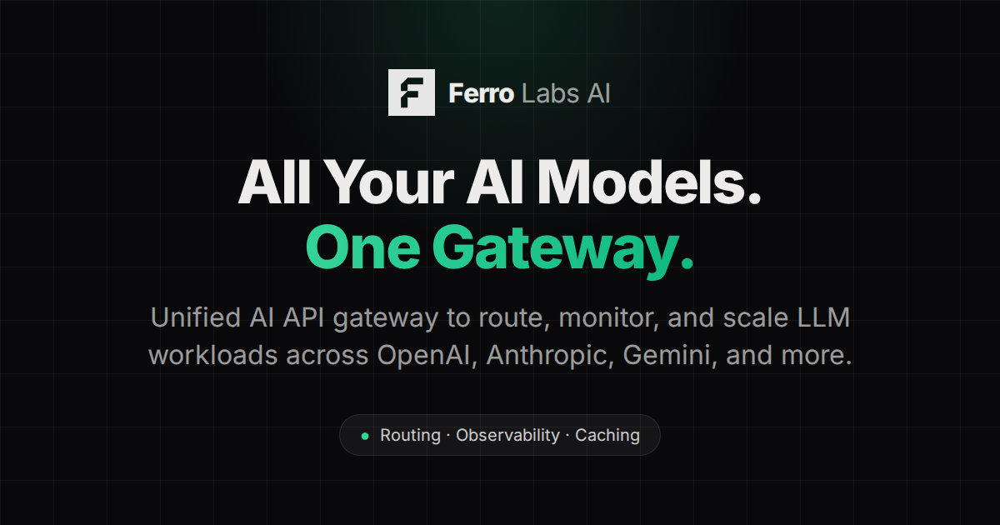

  

  <h1>Ferro Labs</h1>
  

    We are building the enterprise Layer 2C for AI: the control and connectivity layer
    between applications, agents, infrastructure, and model providers.
  

  

    <a href="https://github.com/ferro-labs/ai-gateway">AI Gateway</a>
    ·
    <a href="https://github.com/ferro-labs/model-catalog">Model Catalog</a>
    ·
    <a href="https://github.com/ferro-labs/ferrotunnel">FerroTunnel</a>
    ·
    <a href="https://docs.ferrolabs.ai">Docs</a>
  

## About Ferro Labs AI

Ferro Labs builds infrastructure for teams shipping AI in production.
We focus on the layer between your application and the systems it depends on:
model providers, routing logic, observability, secure connectivity, and deployment primitives.

Our goal is simple: make the AI Gateway ecosystem clear, open, and production-ready.

## AI Gateway Ecosystem Repositories

| Repository | Purpose |
|---|---|
| [`ai-gateway`](https://github.com/ferro-labs/ai-gateway) | Core open-source AI gateway in Go |
| [`model-catalog`](https://github.com/ferro-labs/model-catalog) | Open-source LLM pricing & capability database — 2,468 models, 82 providers |
| [`ferrolabs-python-sdk`](https://github.com/ferro-labs/ferrolabs-python-sdk) | Official Python SDK — `pip install ferrolabsai` |
| [`ferrolabs-typescript-sdk`](https://github.com/ferro-labs/ferrolabs-typescript-sdk) | Official TypeScript SDK — `npm install @ferro-labs-ai/sdk` |
| [`docs`](https://github.com/ferro-labs/ferrolabs-docs) | Official documentation and guides |
| [`ai-gateway-examples`](https://github.com/ferro-labs/ai-gateway-examples) | Integration examples, demos, and reference patterns |
| [`ai-gateway-benchmark-performance`](https://github.com/ferro-labs/ai-gateway-benchmark-performance) | Performance benchmarks and comparison workloads |
| [`helm-charts`](https://github.com/ferro-labs/helm-charts) | Official Helm charts for Kubernetes deployment |

## FerroTunnel

FerroTunnel is our secure, API-first tunneling product for exposing services with public URLs and low-latency forwarding.
It is built for developers and teams who want a lightweight ingress layer without unnecessary complexity.

### FerroTunnel Ecosystem Repositories

| Repository | Purpose |
|---|---|
| [`ferrotunnel`](https://github.com/ferro-labs/ferrotunnel) | Core tunneling product |
| [`homebrew-ferrotunnel`](https://github.com/ferro-labs/homebrew-ferrotunnel) | Homebrew tap for installing FerroTunnel |
| [`tunnel-examples`](https://github.com/ferro-labs/tunnel-examples) | Integration examples and reference patterns for FerroTunnel |
